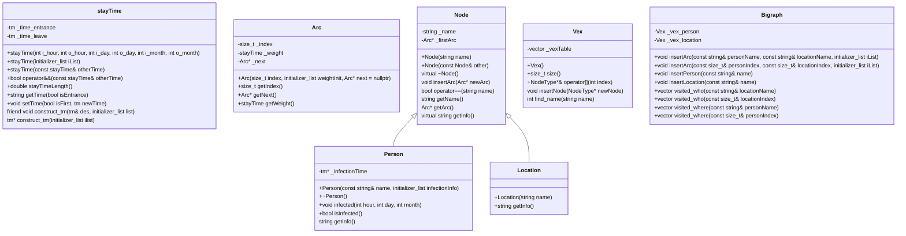
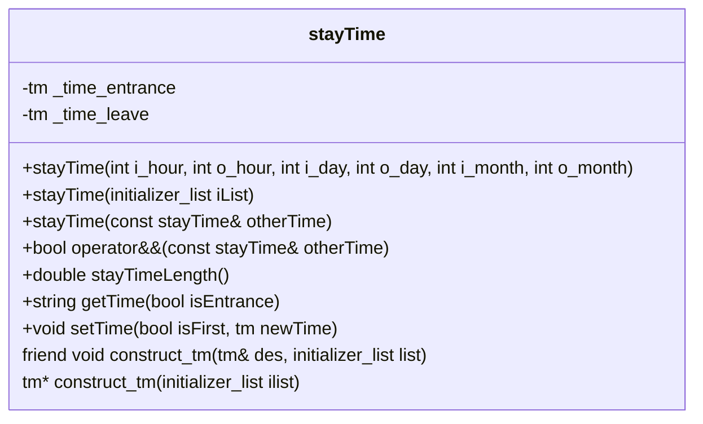
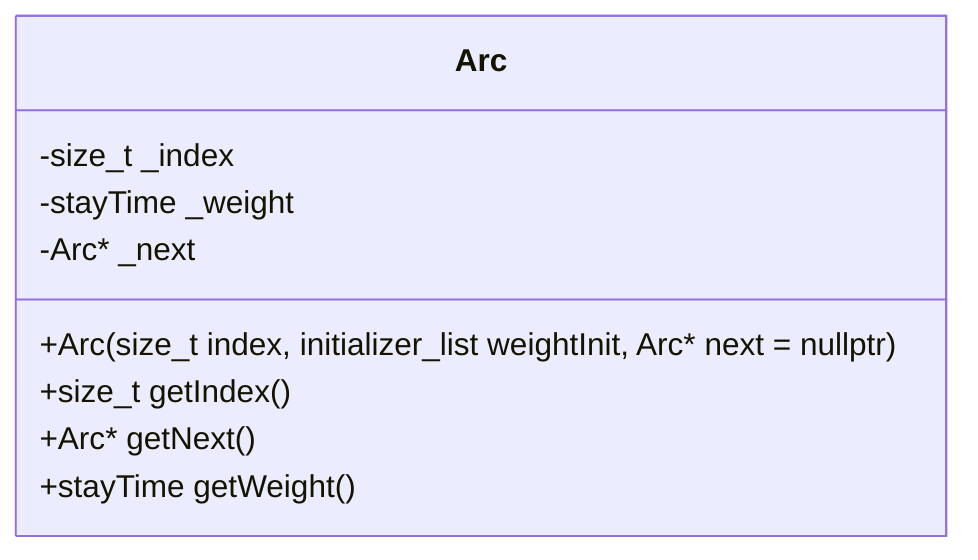
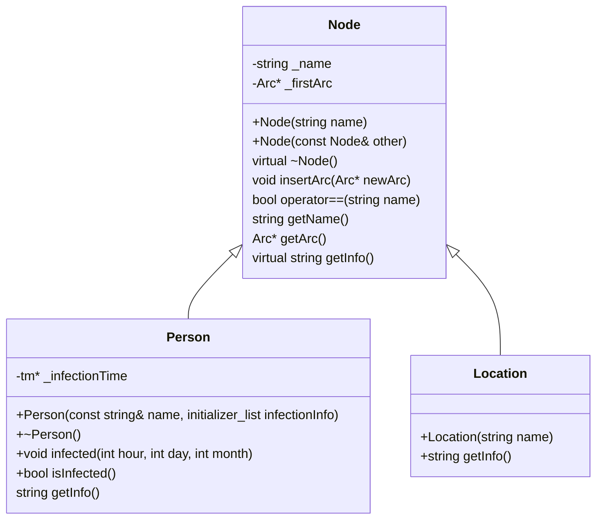
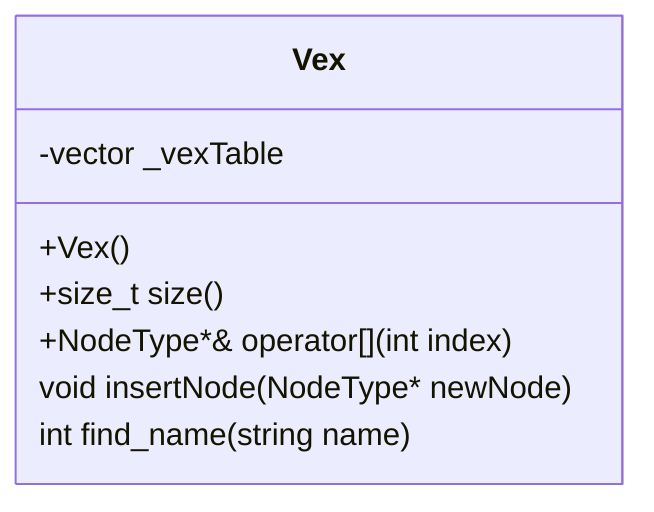
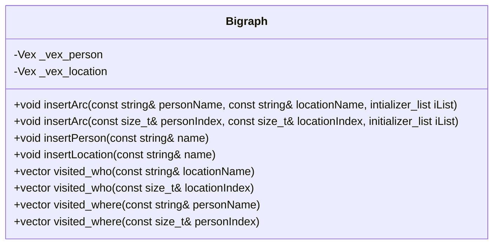

# 

# 技术文档

## 总架构

> 整个项目的逻辑实现如下图，从左到右由基础向上层延伸

```mermaid
classDiagram
	class stayTime{
		-tm _time_entrance
		-tm _time_leave
		
		+stayTime(int i_hour, int o_hour, int i_day, int o_day, int i_month, int o_month)
		+stayTime(initializer_list<int> iList)
		+stayTime(const stayTime& otherTime)
		+bool operator&&(const stayTime& otherTime)
		+double stayTimeLength()
		+string getTime(bool isEntrance)
		+void setTime(bool isFirst, tm newTime)
		
		friend void construct_tm(tm& des, initializer_list<int> list)
		tm* construct_tm(initializer_list<int> ilist)
	}
		class Arc{
		-size_t _index
		-stayTime _weight
		-Arc* _next
		
		+Arc(size_t index, initializer_list<int> weightInit, Arc* next = nullptr)
		+size_t getIndex()
		+Arc* getNext()
		+stayTime getWeight()
	}
		Node <|-- Person
	Node <|-- Location
	class Node{
		-string _name
		-Arc* _firstArc
		
		+Node(string name)
		+Node(const Node& other)
		virtual ~Node()
		void insertArc(Arc* newArc)
		bool operator==(string name)
		string getName()
		Arc* getArc()
		virtual string getInfo()
	}
	class Person{
		-tm* _infectionTime
		
		+Person(const string& name, initializer_list<int> infectionInfo)
		+~Person()
		
		+void infected(int hour, int day, int month)
		+bool isInfected()
		string getInfo()
	}
	class Location{
		+Location(string name)
		+string getInfo()
	}
		class Vex{
		-vector _vexTable
		
		+Vex()
		+size_t size()
		+NodeType*& operator[](int index)
		void insertNode(NodeType* newNode)
		int find_name(string name)
	}
		class Bigraph{
		-Vex<Person> _vex_person
		-Vex<Location> _vex_location
		
		+void insertArc(const string& personName, const string& locationName, intializer_list<int> iList)
		+void insertArc(const size_t& personIndex, const size_t& locationIndex, initializer_list<int> iList)
		+void insertPerson(const string& name)
		+void insertLocation(const string& name)
		+vector<int> visited_who(const string& locationName)
		+vector<int> visited_who(const size_t& locationIndex)
		+vector<int> visited_where(const string& personName)
		+vector<int> visited_where(const size_t& personIndex)
	}
```

```mermaid
classDiagram
	class stayTime{
		-tm _time_entrance
		-tm _time_leave
		
		+stayTime(int i_hour, int o_hour, int i_day, int o_day, int i_month, int o_month)
		+stayTime(initializer_list<int> iList)
		+stayTime(const stayTime& otherTime)
		+bool operator&&(const stayTime& otherTime)
		+double stayTimeLength()
		+string getTime(bool isEntrance)
		+void setTime(bool isFirst, tm newTime)
		
		friend void construct_tm(tm& des, initializer_list<int> list)
		tm* construct_tm(initializer_list<int> ilist)
	}
```

```mermaid
classDiagram
	class Arc{
		-size_t _index
		-stayTime _weight
		-Arc* _next
		
		+Arc(size_t index, initializer_list<int> weightInit, Arc* next = nullptr)
		+size_t getIndex()
		+Arc* getNext()
		+stayTime getWeight()
	}
```

```mermaid
classDiagram	
	Node <|-- Person
	Node <|-- Location
	class Node{
		-string _name
		-Arc* _firstArc
		
		+Node(string name)
		+Node(const Node& other)
		virtual ~Node()
		void insertArc(Arc* newArc)
		bool operator==(string name)
		string getName()
		Arc* getArc()
		virtual string getInfo()
	}
	class Person{
		-tm* _infectionTime
		
		+Person(const string& name, initializer_list<int> infectionInfo)
		+~Person()
		
		+void infected(int hour, int day, int month)
		+bool isInfected()
		string getInfo()
	}
	class Location{
		+Location(string name)
		+string getInfo()
	}
```

```mermaid
classDiagram
	class Vex{
		-vector _vexTable
		
		+Vex()
		+size_t size()
		+NodeType*& operator[](int index)
		void insertNode(NodeType* newNode)
		int find_name(string name)
	}
```

```mermaid
classDiagram
	class Bigraph{
		-Vex<Person> _vex_person
		-Vex<Location> _vex_location
		
		+void insertArc(const string& personName, const string& locationName, intializer_list<int> iList)
		+void insertArc(const size_t& personIndex, const size_t& locationIndex, initializer_list<int> iList)
		+void insertPerson(const string& name)
		+void insertLocation(const string& name)
		+vector<int> visited_who(const string& locationName)
		+vector<int> visited_who(const size_t& locationIndex)
		+vector<int> visited_where(const string& personName)
		+vector<int> visited_where(const size_t& personIndex)
	}
```

